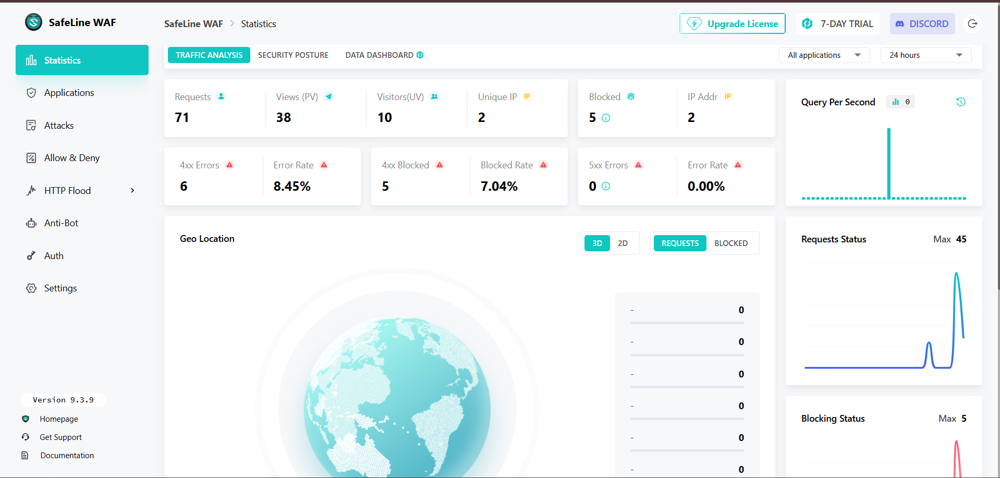
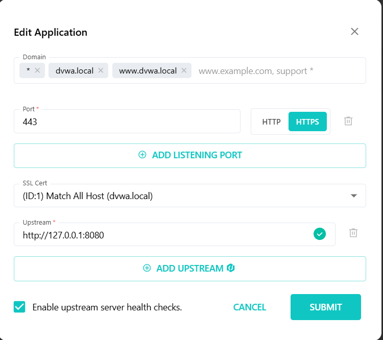
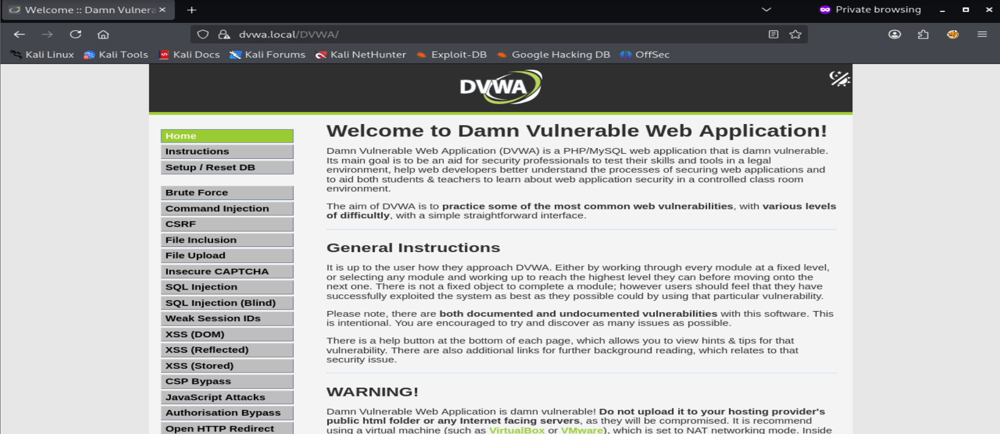
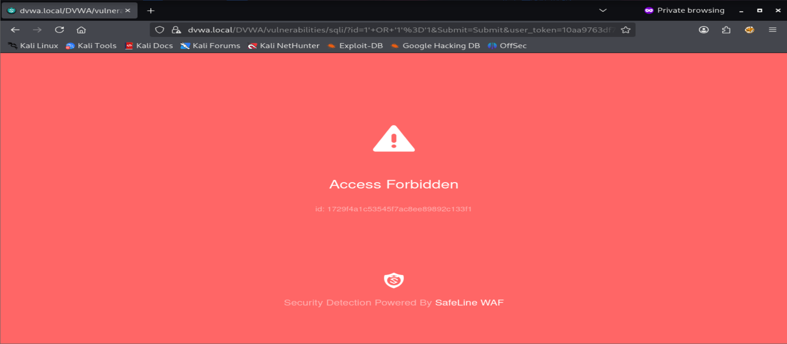
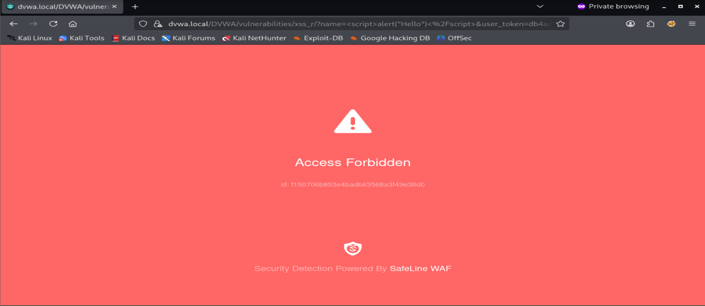
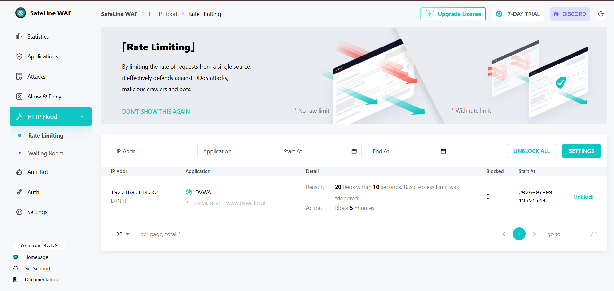
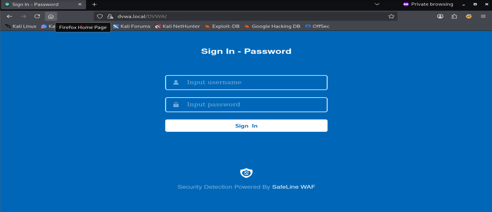
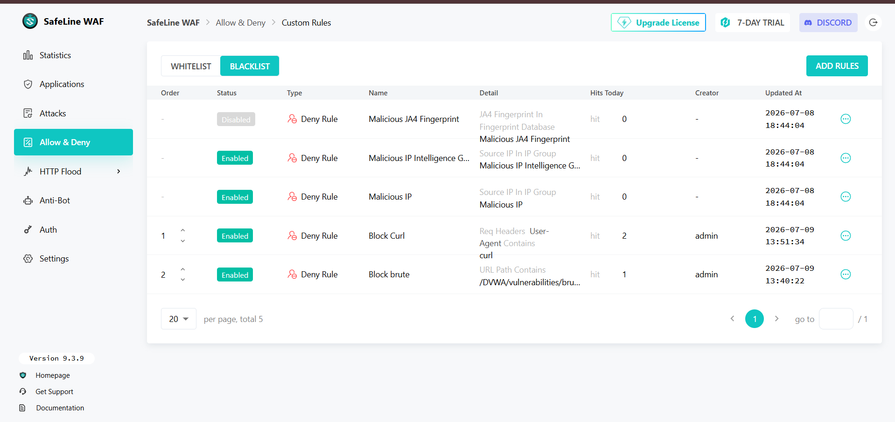
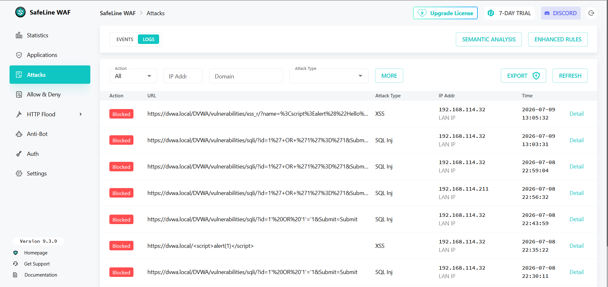

# 🛡️ SafeLine WAF + DVWA Security Lab


---

## 📌 Project Overview

This project demonstrates the deployment of **SafeLine Web Application Firewall (WAF)** to protect the **Damn Vulnerable Web Application (DVWA)** from common web attacks.

The lab simulates a real-world deployment where SafeLine operates as a **reverse proxy**, inspecting all incoming HTTPS requests before forwarding legitimate traffic to the backend Apache web server.

The project demonstrates how a WAF can identify, block, and log malicious web traffic while allowing legitimate users to access the protected application.

The entire environment was deployed inside VMware using Ubuntu and Kali Linux virtual machines connected through a bridged network.

---

# 📖 Table of Contents

- [Project Overview](#-project-overview)
- [Objectives](#-objectives)
- [Features](#-features)
- [Technologies Used](#-technologies-used)
- [Lab Architecture](#-lab-architecture)
- [Repository Structure](#repository-structure)
- [Installation Summary](#-installation-summary)
- [Security Testing](#-security-testing)
- [Attack Monitoring](#-attack-monitoring)
- [Screenshots](#-screenshots)
- [Skills Demonstrated](#-skills-demonstrated)
- [Learning Outcomes](#-learning-outcomes)
- [Future Improvements](#-future-improvements)
- [Project Note](#-project-note)

---

# 🎯 Objectives

This project was developed to:

- Deploy SafeLine Web Application Firewall
- Deploy Damn Vulnerable Web Application (DVWA)
- Configure Reverse Proxy Architecture
- Configure HTTPS using SSL certificates
- Protect DVWA using SafeLine
- Demonstrate common web attacks
- Configure multiple WAF security features
- Monitor and analyze attack logs

---

# 🚀 Features

✅ Reverse Proxy Deployment

✅ HTTPS Termination

✅ Apache Backend Configuration

✅ SQL Injection Protection

✅ Cross-Site Scripting (XSS) Protection

✅ HTTP Flood Defense

✅ Authentication Gateway

✅ Custom URL Blocking

✅ Custom Request Header Blocking

✅ Attack Logging

✅ Security Monitoring

---

# 🛠 Technologies Used

| Component | Version |
|-----------|---------|
| Ubuntu | 26.04 LTS |
| Apache | 2.4.66 |
| PHP | 8.5.4 |
| MariaDB | 11.8.6 |
| Docker | 29.6.1 |
| SafeLine WAF | 9.3.9 |
| Kali Linux | 2026.3 |
| DVWA | Latest GitHub Version |
| Virtualization | VMware Workstation |

---

# 🏗 Lab Architecture


---

## Architecture Overview

The lab consists of two virtual machines connected using **VMware Bridged Networking**.

### Ubuntu VM

The Ubuntu virtual machine hosts:

- SafeLine WAF
- Apache Web Server
- PHP
- MariaDB
- DVWA

Apache serves DVWA on **port 8080**, while SafeLine exposes the application securely over **HTTPS (port 443)**.

---

### Kali Linux VM

The Kali Linux virtual machine acts as the testing workstation.

Tools used:

- Firefox
- curl
- ApacheBench (ab)

The machine is used to generate both normal and malicious traffic for validating the WAF configuration.

---

# Repository Structure

```text
SafeLine-DVWA-WAF-Lab
│
├── README.md
├── CHANGELOG.md
│
├── docs
│   ├── Installation.md
│   ├── Testing.md
│   ├── Commands.md
│   ├── Troubleshooting.md
│   └── Architecture.md
│
├── images
│
├── scripts
│
└── apache
```

---

# ⚙ Installation Summary

The deployment consists of the following stages.

1. Ubuntu Installation

2. Apache, PHP and MariaDB Installation

3. DVWA Deployment

4. SafeLine WAF Installation

5. Reverse Proxy Configuration

6. HTTPS Configuration

7. Local Hostname Configuration

8. DVWA Database Initialization

9. Security Feature Configuration

10. Security Testing

---

# 🧪 Security Testing

The deployed lab was validated by performing multiple web application security tests against DVWA through SafeLine WAF.

The objective was to verify that SafeLine could inspect incoming requests, detect malicious payloads, enforce configured security policies, and generate security events.

The following security features were successfully tested.

| Security Feature | Status |
|------------------|:------:|
| SQL Injection Protection | ✅ |
| Cross-Site Scripting (XSS) Protection | ✅ |
| HTTP Flood Defense | ✅ |
| Authentication Gateway | ✅ |
| Custom URL Blocking | ✅ |
| Custom Request Header Blocking | ✅ |
| Attack Logging | ✅ |

Detailed testing procedures are available in **docs/Testing.md**.

---

# 📸 Screenshots

The following screenshots demonstrate the successful deployment and testing of the SafeLine WAF lab.

---

## SafeLine Dashboard

The SafeLine dashboard provides an overview of requests, protected applications, blocked attacks, and system status.



---

## Reverse Proxy Configuration

SafeLine was configured as a reverse proxy that forwards legitimate HTTPS requests to the Apache backend running DVWA.



---

## DVWA Home Page

DVWA was successfully deployed and accessed securely through SafeLine using HTTPS.



---

## SQL Injection Protection

The SQL Injection payload was intercepted and blocked before reaching the vulnerable application.

**Example Payload**

```sql
1' OR '1'='1
```



---

## Cross-Site Scripting (XSS) Protection

SafeLine detected and blocked malicious JavaScript before it could be executed by the browser.

**Example Payload**

```html
<script>alert('XSS')</script>
```



---

## HTTP Flood Defense

HTTP Flood protection was validated by generating multiple concurrent requests using ApacheBench.

SafeLine successfully detected excessive requests and applied rate limiting.



---

## Authentication Gateway

Authentication Gateway was configured to require user authentication before allowing access to the protected application.



---

## Custom Deny Rule

Custom access control rules were created to block specific requests.

The lab demonstrates:

- URL path blocking
- Request header filtering



---

## Attack Logs

SafeLine records every detected attack, allowing administrators to review security events and investigate malicious activity.

Logged information includes:

- Timestamp
- Source IP
- Destination URL
- Attack Type
- Triggered Rule
- Action Taken



---

# 📊 Attack Monitoring

SafeLine provides centralized visibility into web application attacks.

During testing, the dashboard successfully detected and logged:

- SQL Injection attempts
- Cross-Site Scripting attacks
- HTTP Flood activity
- Custom Deny Rule violations

The monitoring dashboard enables administrators to identify attack trends, investigate malicious requests, and verify that security policies are operating correctly.

---

# 🔐 Security Features Implemented

The following security mechanisms were configured as part of this project.

| Feature | Description |
|----------|-------------|
| Reverse Proxy | Safely forwards client requests to the backend server |
| HTTPS | Encrypts communication between client and WAF |
| SQL Injection Protection | Detects and blocks SQL Injection payloads |
| XSS Protection | Detects and blocks malicious JavaScript |
| HTTP Flood Defense | Protects against excessive HTTP requests |
| Authentication Gateway | Restricts access before reaching DVWA |
| Custom URL Blocking | Blocks access to selected application paths |
| Request Header Blocking | Blocks requests based on HTTP request headers |
| Attack Logging | Records detected attacks for monitoring and analysis |

---

# 📂 Supporting Documentation

Additional documentation is available in the **docs** directory.

| Document | Description |
|----------|-------------|
| Installation.md | Complete deployment guide |
| Testing.md | Attack validation procedures |
| Commands.md | Frequently used commands |
| Troubleshooting.md | Common issues and solutions |
| Architecture.md | Network architecture and request flow |

---

# 💡 Skills Demonstrated

This project provided hands-on experience with the following cybersecurity concepts and technologies.

### Web Security

- Web Application Firewall (WAF) Deployment
- Reverse Proxy Configuration
- HTTPS Configuration
- SSL Certificate Management
- HTTP Request Inspection
- Access Control
- Security Policy Enforcement

---

### Attack Detection

- SQL Injection Detection
- Cross-Site Scripting (XSS) Detection
- HTTP Flood Mitigation
- Request Header Inspection
- URL Filtering
- Attack Logging

---

### System Administration

- Ubuntu Server Administration
- Apache Web Server Configuration
- PHP Configuration
- MariaDB Administration
- Docker Container Management
- Virtual Machine Networking

---

### Security Testing

- DVWA Deployment
- Web Application Security Testing
- HTTP Request Analysis
- Attack Validation
- Security Event Monitoring

---

# 📚 Learning Outcomes

Through this project, I gained practical experience in:

- Deploying a Web Application Firewall in front of a web application.
- Configuring a reverse proxy to securely expose backend services.
- Deploying and configuring DVWA for web application security testing.
- Configuring HTTPS using SSL certificates.
- Understanding how SafeLine inspects HTTP requests before forwarding them to backend services.
- Configuring multiple WAF protection mechanisms.
- Creating custom access control rules.
- Monitoring attack events using the SafeLine dashboard.
- Troubleshooting deployment and networking issues.
- Documenting and validating a complete cybersecurity lab.

---

# 🔮 Future Improvements

Potential enhancements for this project include:

- Deploying multiple protected web applications behind a single WAF.
- Integrating a SIEM platform for centralized log analysis.
- Configuring external authentication providers such as LDAP or OAuth.
- Creating additional custom WAF rules.
- Automating security testing using scripting tools.
- Evaluating protection against additional OWASP Top 10 attack categories.

---

# 📂 Project Documentation

Additional documentation is available in the **docs** directory.

| Document | Description |
|----------|-------------|
| Installation.md | Deployment and configuration guide |
| Testing.md | Security testing procedures |
| Commands.md | Frequently used commands |
| Troubleshooting.md | Common issues and solutions |
| Architecture.md | Network architecture and request flow |

---

# 📝 Project Note

This repository documents my hands-on implementation, configuration, testing, and troubleshooting of a SafeLine Web Application Firewall protecting DVWA in a virtual lab environment.

The project demonstrates practical experience in deploying, configuring, and validating multiple web application security features in a controlled environment.

---

# 📌 Changelog

Project updates are maintained in:

**CHANGELOG.md**

---

# 📜 References

- SafeLine Official Documentation  
  https://docs.waf.chaitin.com/

- SafeLine GitHub Repository  
  https://github.com/chaitin/SafeLine

- DVWA GitHub Repository  
  https://github.com/digininja/DVWA

- OWASP Top 10  
  https://owasp.org/www-project-top-ten/

---

# 🤝 Contributing

This repository was created as a personal cybersecurity learning project.

If you have suggestions for improving the documentation or the lab setup, feel free to open an issue or submit a pull request.

---

# ⭐ Conclusion

This project demonstrates the deployment and configuration of a Web Application Firewall (WAF) using SafeLine to protect a vulnerable web application.

The completed lab successfully implements:

- Reverse Proxy
- HTTPS Termination
- SQL Injection Protection
- Cross-Site Scripting (XSS) Protection
- HTTP Flood Defense
- Authentication Gateway
- Custom Deny Rules
- Attack Logging and Monitoring

This repository serves as a practical demonstration of web application security concepts and provides a reproducible lab environment for learning and experimentation.

For complete deployment instructions, refer to:

📄 **docs/Installation.md**
