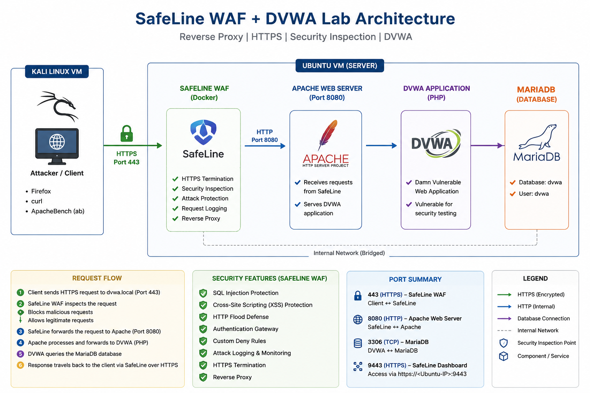

# 🛡️ SafeLine WAF + DVWA Security Lab


## 📌 Project Overview

This project demonstrates the deployment of a Web Application Firewall (WAF) using **SafeLine** to protect the **Damn Vulnerable Web Application (DVWA)** running on an Apache web server.

The objective of this lab is to understand how a modern WAF can inspect HTTP/HTTPS traffic, detect malicious requests, enforce security policies, and protect vulnerable web applications from common attacks.

The environment was built using Ubuntu, Docker, Apache, MariaDB, PHP, SafeLine WAF, and Kali Linux for security testing.

---

## 🎯 Objectives

- Deploy DVWA on Ubuntu
- Configure Apache as the backend web server
- Deploy SafeLine WAF using Docker
- Configure Reverse Proxy
- Enable HTTPS using SSL certificates
- Protect DVWA using SafeLine
- Demonstrate attack detection and prevention
- Understand WAF configuration and rule management

---

## 🚀 Features

- Reverse Proxy Configuration
- HTTPS Protection
- SSL Certificate Configuration
- SQL Injection Detection & Blocking
- Cross-Site Scripting (XSS) Protection
- HTTP Flood Defense (Rate Limiting)
- Authentication Gateway
- Custom URL Blocking Rules
- Custom Request Header Blocking Rules
- Attack Logging & Monitoring

---

## 🛠️ Technologies Used

| Component | Version |
|-----------|---------|
| Ubuntu | 26.04 LTS |
| Apache | 2.4.66 |
| PHP | 8.5.4 |
| MariaDB | 11.8.6 |
| SafeLine WAF | 9.3.9 |
| Docker | 29.6.1 |
| Kali Linux | 2026.3 |
| DVWA | Latest GitHub Version |

---

## 🏗️ Lab Architecture



```
Kali Linux
      │
 HTTPS Requests
      │
      ▼
+---------------------+
|    SafeLine WAF     |
|---------------------|
| Reverse Proxy       |
| SQL Injection       |
| XSS Protection      |
| HTTP Flood Defense  |
| Authentication      |
| Custom Rules        |
| Attack Logging      |
+---------------------+
      │
 HTTP (8080)
      │
      ▼
+---------------------+
| Apache Web Server   |
+---------------------+
      │
      ▼
+---------------------+
|        DVWA         |
+---------------------+
      │
      ▼
+---------------------+
|      MariaDB        |
+---------------------+
```

---

## 📂 Repository Structure

```text
SafeLine-DVWA-WAF-Lab/
├── README.md
├── docs/
├── images/
├── scripts/
└── apache/
```

---

## 📸 Screenshots

The repository includes screenshots demonstrating:

- SafeLine Dashboard
- Reverse Proxy Configuration
- DVWA Login
- SQL Injection Protection
- XSS Protection
- HTTP Flood Defense
- Authentication Gateway
- Custom Deny Rules
- Attack Logs

---

# ⚙️ Installation Summary

The lab environment was built using the following high-level steps:

1. Installed Ubuntu 26.04 LTS.
2. Installed Apache, PHP, and MariaDB.
3. Deployed DVWA from the official GitHub repository.
4. Configured the DVWA database.
5. Installed SafeLine WAF using Docker.
6. Configured SafeLine as a Reverse Proxy.
7. Generated and imported SSL certificates.
8. Enabled HTTPS access through SafeLine.
9. Verified application accessibility through the WAF.
10. Configured and tested multiple security features.

> 📖 Detailed installation steps are available in **docs/Installation.md**

---

# 🧪 Security Testing

The following attack scenarios were tested against DVWA through SafeLine WAF.

## 1. SQL Injection Protection

### Attack

```
1' OR '1'='1
```

### Result

- SafeLine detected the malicious payload.
- The request was blocked before reaching DVWA.
- The attack was recorded in the SafeLine dashboard.

**Screenshot**

```
images/sql-blocked.png
```

---

## 2. Cross-Site Scripting (XSS)

### Attack

```html
<script>alert('Hello')</script>
```

### Result

- SafeLine identified the malicious JavaScript payload.
- Access was denied.
- The attack was logged successfully.

**Screenshot**

```
images/xss-blocked.png
```

---

## 3. HTTP Flood Defense

To simulate high-volume traffic, multiple HTTP requests were generated from Kali Linux.

### Objective

Demonstrate SafeLine's rate-limiting capability.

### Result

- SafeLine detected excessive requests.
- Rate limiting was applied.
- Flood traffic was mitigated.

**Screenshot**

```
images/http-flood.png
```

---

## 4. Authentication Gateway

SafeLine Authentication was configured to protect the application before requests reached DVWA.

### Result

- Users were required to authenticate before accessing the application.
- Unauthorized users could not access the protected resource.

**Screenshot**

```
images/auth-gateway.png
```

---

## 5. Custom Deny Rules

Custom access control rules were configured to demonstrate policy enforcement.

### URL Path Blocking

A rule was created to block access to selected DVWA pages.

Example:

```
/DVWA/vulnerabilities/brute/
```

Result:

- Access was denied.
- SafeLine logged the request.

---

### Request Header Blocking

A custom rule was configured to inspect HTTP request headers.

Requests containing the keyword:

```
curl
```

were denied.

Result:

- Browser access continued to work normally.
- Requests sent using `curl` were blocked by SafeLine.

**Screenshot**

```
images/custom-deny.png
```

---

# 📊 Attack Monitoring

SafeLine provides real-time monitoring and logging for all detected attacks.

The dashboard records information such as:

- Source IP
- Attack Type
- Requested URL
- Timestamp
- Action Taken
- Application Name

This enables administrators to monitor malicious activity and investigate security events.

**Screenshot**

```
images/attack-logs.png
```

---

# 📚 Learning Outcomes

This project helped me gain practical experience with:

- Reverse Proxy deployment
- Web Application Firewall (WAF) configuration
- HTTPS and SSL certificate management
- Apache web server administration
- Docker deployment
- SQL Injection detection
- Cross-Site Scripting (XSS) protection
- HTTP Flood mitigation
- Authentication Gateway configuration
- Custom security rule creation
- Security event monitoring
- Web application security testing

---

# 🔮 Future Improvements

Potential enhancements for this lab include:

- Integrating a SIEM platform for centralized log monitoring.
- Configuring external authentication providers such as LDAP or OAuth.
- Adding OWASP CRS-based custom rules.
- Automating attack simulations using security testing tools.
- Monitoring multiple protected web applications through a single WAF instance.

---

# 🙏 Acknowledgements

This repository documents my hands-on implementation, configuration, testing, and troubleshooting of a SafeLine WAF and DVWA lab environment for cybersecurity learning.
